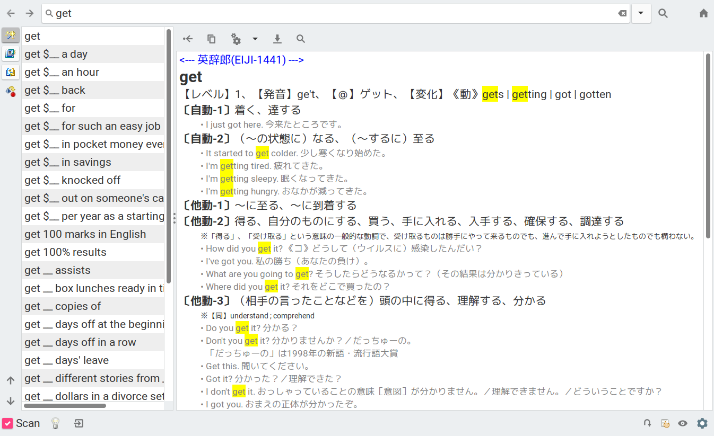

Tool for converting Eijiro dictionary into StarDict one
=======================================================

Requirements
------------

- StarDict tools
- Ruby 2.0 or above
- dictzip

Usage
-----

For example, supposing that you downloaded `EDP-1441.zip`, then you can build a
set of StarDict dictionary files and install them as follows:

~~~sh
$ unzip /path/to/EDP-1441.zip
$ make
$ make install
~~~

TODO
----

[ ] Output in the XDXF markup language will be better than the current Pango markup for portability and expressiveness.

License
-------

MIT License
